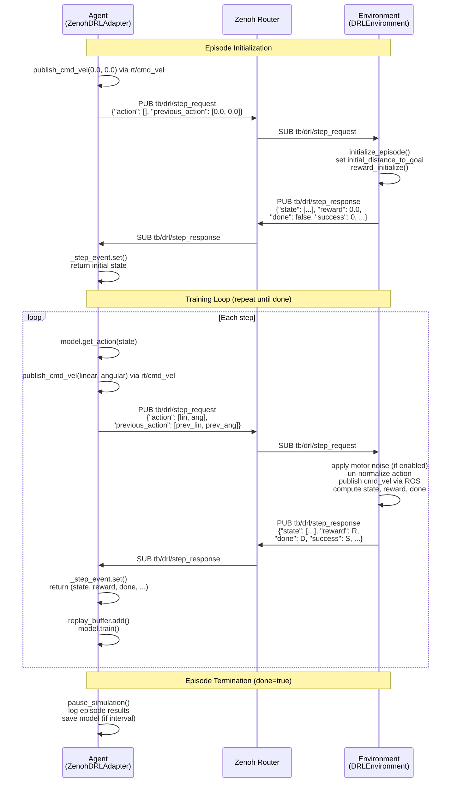

# Zenoh Step Synchronization Protocol

This document specifies the step synchronization protocol used between the DRL agent and the simulation environment when communicating over [Zenoh](https://zenoh.io/) instead of the traditional ROS 2 `DrlStep.srv` service.

## 1. Overview

In the standard ROS 2 architecture, the agent calls the `/step_comm` service (type `DrlStep.srv`) synchronously. The Zenoh-decoupled architecture replaces this with a **pub/sub request-response pattern** over two Zenoh key-expressions:

| Direction | Key-Expression | Encoding | Publisher | Subscriber |
|-----------|---------------|----------|-----------|------------|
| Request | `tb/drl/step_request` | JSON (UTF-8) | Agent (`ZenohDRLAdapter`) | Environment (`DRLEnvironment`) |
| Response | `tb/drl/step_response` | JSON (UTF-8) | Environment (`DRLEnvironment`) | Agent (`ZenohDRLAdapter`) |

The `tb/` prefix is used for application-level topics that do **not** pass through `zenoh-bridge-ros2dds` (which uses the `rt/` prefix for bridged ROS topics).

## 2. Message Formats

### 2.1 Step Request (`tb/drl/step_request`)

```json
{
  "action": [<linear: float>, <angular: float>],
  "previous_action": [<linear: float>, <angular: float>]
}
```

| Field | Type | Description |
|-------|------|-------------|
| `action` | `float[]` | Normalized action `[linear, angular]`. An **empty array** `[]` signals episode initialization (reset). |
| `previous_action` | `float[]` | Normalized action from the previous step. Set to `[0.0, 0.0]` on episode init. |

**JSON Schema:**

```json
{
  "$schema": "https://json-schema.org/draft/2020-12/schema",
  "type": "object",
  "required": ["action", "previous_action"],
  "properties": {
    "action": {
      "type": "array",
      "items": { "type": "number" },
      "description": "Normalized [linear, angular] action. Empty array [] for episode init."
    },
    "previous_action": {
      "type": "array",
      "items": { "type": "number" },
      "minItems": 2,
      "maxItems": 2,
      "description": "Normalized [linear, angular] action from the previous step."
    }
  }
}
```

### 2.2 Step Response (`tb/drl/step_response`)

```json
{
  "state": [<float>, ...],
  "reward": <float>,
  "done": <bool>,
  "success": <int>,
  "distance_traveled": <float>
}
```

| Field | Type | Description |
|-------|------|-------------|
| `state` | `float[44]` | Observation vector: 40 normalized LiDAR samples + goal distance + goal angle + previous linear action + previous angular action. |
| `reward` | `float` | Scalar reward for the transition. `0.0` on episode init. |
| `done` | `bool` | Whether the episode has terminated (collision, goal reached, timeout, tumble). |
| `success` | `int` | Outcome code (see table below). `0` (UNKNOWN) while episode is ongoing. |
| `distance_traveled` | `float` | Cumulative distance traveled during the episode. Non-zero only when `done` is `true`. |

**Outcome codes** (defined in `common/settings.py`):

| Code | Constant | Meaning |
|------|----------|---------|
| 0 | `UNKNOWN` | Episode still in progress |
| 1 | `SUCCESS` | Robot reached the goal |
| 2 | `COLLISION_WALL` | Robot collided with a wall |
| 3 | `COLLISION_OBSTACLE` | Robot collided with a dynamic obstacle |
| 4 | `TIMEOUT` | Episode time limit exceeded |
| 5 | `TUMBLE` | Robot tipped over |

**JSON Schema:**

```json
{
  "$schema": "https://json-schema.org/draft/2020-12/schema",
  "type": "object",
  "required": ["state", "reward", "done", "success", "distance_traveled"],
  "properties": {
    "state": {
      "type": "array",
      "items": { "type": "number" },
      "minItems": 44,
      "maxItems": 44,
      "description": "44-dimensional observation vector."
    },
    "reward": {
      "type": "number",
      "description": "Step reward."
    },
    "done": {
      "type": "boolean",
      "description": "True if the episode has ended."
    },
    "success": {
      "type": "integer",
      "minimum": 0,
      "maximum": 5,
      "description": "Outcome code (0=UNKNOWN through 5=TUMBLE)."
    },
    "distance_traveled": {
      "type": "number",
      "minimum": 0.0,
      "description": "Cumulative distance traveled. Non-zero only when done=true."
    }
  }
}
```

## 3. Sequence Diagram

### 3.1 Full Episode Lifecycle



### 3.2 Single Step Detail

```
Agent                          Zenoh                        Environment
  |                              |                              |
  |-- clear _step_event -------->|                              |
  |-- PUB step_request --------->|-- deliver ------------------>|
  |                              |                              |
  |   (agent blocks on           |    env computes state,       |
  |    _step_event.wait()        |    reward, done, outcome)    |
  |    with timeout)             |                              |
  |                              |<-- PUB step_response --------|
  |<-- deliver ------------------|                              |
  |                              |                              |
  |-- _step_event.set() --------|                              |
  |-- return (state,reward,...) -|                              |
```

## 4. Timeout Handling and Error Recovery

### 4.1 Step Timeout

The agent waits for a step response using `threading.Event.wait(timeout)`. The default timeout is **10.0 seconds** (`DEFAULT_STEP_TIMEOUT`), configurable via the `step_timeout` constructor parameter.

If no response arrives within the timeout:

1. A `TimeoutError` is raised with message: `"No step response received within {timeout}s. Is the environment node running?"`
2. The caller (training loop) is responsible for catching and handling this exception.
3. The `_step_event` and `_step_response` are left in their cleared/None state, so the next call to `step()` will start clean.

### 4.2 Malformed Response

If the step response JSON cannot be decoded, the `_on_step_response` callback prints an error and does **not** set `_step_event`. This causes the agent to eventually hit the timeout. The environment side similarly prints an error and returns without publishing a response if the request payload is malformed.

### 4.3 Recovery Strategies

| Failure | Symptom | Recovery |
|---------|---------|----------|
| Environment not running | Immediate timeout on first step | Start environment node, retry |
| Zenoh router unreachable | Timeout (no pub/sub delivery) | Check `zenoh-router` container, check network |
| Malformed request JSON | Environment logs error, no response sent | Fix agent serialization bug |
| Malformed response JSON | Agent logs error, timeout | Fix environment serialization bug |
| Environment crash mid-episode | Timeout on next step | Restart environment, agent will timeout and can be restarted |

### 4.4 Thread Safety

All cached sensor state (`_scan_ranges`, `_robot_x`, `_robot_y`, etc.) is protected by `threading.Lock`. The step synchronization uses `threading.Event` for blocking wait/notify. Zenoh callbacks execute on Zenoh's internal threads; the `step()` method blocks on the calling thread (the agent's training loop).

## 5. Backward Compatibility

The Zenoh step protocol operates **in parallel** with the existing ROS 2 service communication:

```
                    +------------------+
                    |   DRLEnvironment |
                    |                  |
  ROS2 Service ---->| step_comm_server |----> ROS2 DrlStep.Response
  /step_comm        |                  |
                    |                  |
  Zenoh pub/sub --->| _zenoh_step_     |----> tb/drl/step_response
  tb/drl/step_req   |   handler()      |
                    +------------------+
```

Key compatibility points:

1. **Environment node runs both paths simultaneously.** The `DRLEnvironment` node creates the ROS 2 service server (`step_comm`) and, if `zenoh-python` is importable, also opens a Zenoh session with the step subscriber/publisher. Both paths call the same internal logic (`get_state()`, reward computation, episode reset).

2. **Graceful degradation.** If `zenoh-python` is not installed, the environment prints a warning and continues with ROS 2 only. The `ZENOH_AVAILABLE` flag gates all Zenoh initialization.

3. **Agent chooses one path.** The standard `DrlAgent` (ROS 2 node) uses the `/step_comm` service. The `ZenohDRLAdapter` uses Zenoh pub/sub. They are not intended to run simultaneously against the same environment instance (this would cause duplicate actions).

4. **Identical response semantics.** The Zenoh JSON response fields map 1:1 to `DrlStep.srv` response fields:

   | DrlStep.srv field | Zenoh JSON field | Type |
   |-------------------|-----------------|------|
   | `state` | `"state"` | `float32[]` / `float[]` |
   | `reward` | `"reward"` | `float32` / `float` |
   | `done` | `"done"` | `bool` / `bool` |
   | `success` | `"success"` | `uint32` / `int` |
   | `distance_traveled` | `"distance_traveled"` | `float32` / `float` |

## 6. Episode Init / Reset Over Zenoh

Episode initialization is signaled by sending a step request with an **empty action array**:

```json
{"action": [], "previous_action": [0.0, 0.0]}
```

When the environment receives an empty action:

1. It records `initial_distance_to_goal` from the current `goal_distance`.
2. It calls `get_state(0, 0)` to build the initial observation (with zero previous actions).
3. It calls `reward_initialize(initial_distance_to_goal)` to reset the reward function.
4. It responds with `reward=0.0`, `done=false`, `success=UNKNOWN(0)`, `distance_traveled=0.0`.

The agent side wraps this in `init_episode()`:

```python
def init_episode(self) -> List[float]:
    state, _, _, _, _ = self.step(action=[], previous_action=[0.0, 0.0])
    return state
```

Before calling `init_episode()`, the agent also:
- Publishes a zero-velocity command (`cmd_vel` with `linear.x=0`, `angular.z=0`) to stop the robot.
- Waits for the goal manager to publish a new goal on `rt/goal_pose` (via `wait_for_goal()`).

The environment's episode-end reset (spawning new goal, resetting `local_step`, `total_distance`, etc.) happens on the **previous** step when `done=true` is returned. The subsequent init request starts the new episode cleanly.

## 7. All Zenoh Key-Expressions

For completeness, here are all Zenoh key-expressions used in the system:

| Key-Expression | Direction | Encoding | Purpose |
|---------------|-----------|----------|---------|
| `rt/scan` | Gazebo -> Agent | CDR (`sensor_msgs/LaserScan`) | LiDAR scan data (via zenoh-bridge-ros2dds) |
| `rt/odom` | Gazebo -> Agent | CDR (`nav_msgs/Odometry`) | Robot odometry (via zenoh-bridge-ros2dds) |
| `rt/goal_pose` | Goal Manager -> Agent | CDR (`geometry_msgs/Pose`) | Goal position (via zenoh-bridge-ros2dds) |
| `rt/cmd_vel` | Agent -> Gazebo | CDR (`geometry_msgs/Twist`) | Velocity commands (via zenoh-bridge-ros2dds) |
| `tb/drl/step_request` | Agent -> Environment | JSON | Step synchronization request |
| `tb/drl/step_response` | Environment -> Agent | JSON | Step synchronization response |
| `tb/drl/metrics` | Agent -> (any) | JSON | Training metrics (episode, reward, loss) |
